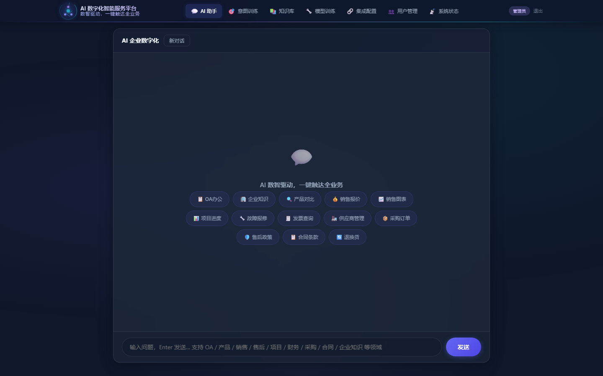
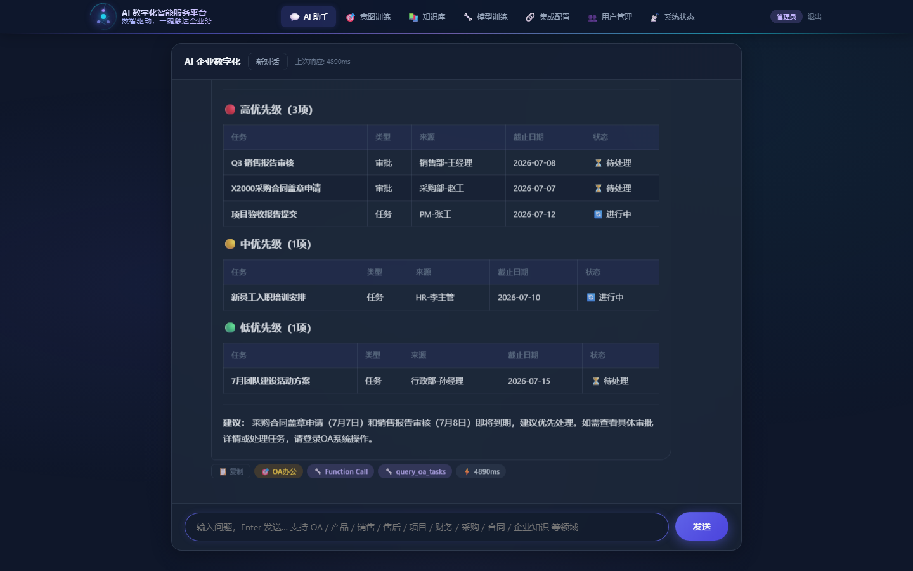
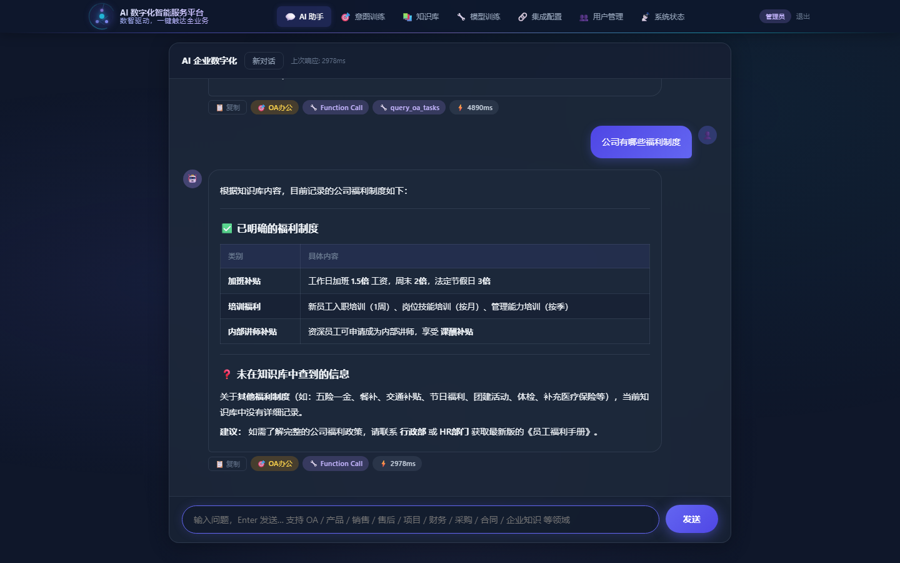

# 🤖 AI 数字化智能服务平台

> **AI 数智驱动，一键触达全业务**

基于深度学习的智能企业助手，集成 意图识别、RAG 检索、Reranker 重排序、Function Calling 工具调用和多轮对话能力，覆盖 OA、产品、销售、售后、项目、财务、采购、法务、企业知识九大业务领域。

AI 数字化智能服务平台，秉承"AI 数智驱动，一键触达全业务"的核心理念，是企业级深度学习智能调度引擎，旨在加速企业数字化转型进程。

针对产品参数、报价方案、项目进度、合同条款等核心业务数据深陷 ERP、CRM、OA 等异构系统的事实，平台以自然语言对话为统一交互入口，有效解决员工跨系统查询的高昂成本与低效响应。底层融合 BERT 意图识别、ChromaDB 向量检索、CrossEncoder 精准重排与 LLM Function Calling 智能体等前沿技术，通过 API 工具对分散数据进行智能编排。用户仅需一句指令，即可自动触发意图理解、跨源调度与专业回复生成，实现真正的"一键触达"。

平台深度覆盖产品、销售、售后、财务等全业务场景，内置 意图识别体系、在线训练管理、模型微调引擎与自主知识库，并搭载 RBAC 三级权限管控。同时支持私有化部署与深度定制，为企业提供从智能问答到数据驱动决策的全链路 AI 赋能。

---

## 企业痛点与解决方案

### 痛点 1：信息孤岛 — 数据分散，查找费时

产品参数在 ERP、报价在 CRM、合同在 OA、项目进度在 PM 系统……员工每天在多个系统间切换，跨部门协作效率极低。

**AI 解决方案**：统一对话入口，API 工具集成后端各业务系统。一句话自然语言提问，AI 自动路由到正确数据源，**无需切换任何系统**。

> _"X2000-Pro 和 K-500S 有什么区别？"_ → AI 自动调产品工具 + 对比分析

### 痛点 2：响应缓慢 — 人工查询效率低

客户问订单状态、产品对比、发票进度，员工需要逐个系统查询，平均响应时间超过 5 分钟，高峰期客户排队等待。

**AI 解决方案**：意图自动识别（BERT 推理）+ Function Calling 自动调工具，**端到端响应**。

> _"PO20260601 货到哪了？"_ → AI 秒级返回订单状态 + 物流信息 + 预计送达

### 痛点 3：知识流失 — 经验随人走，新人上手慢

资深员工离职带走宝贵经验知识，新人培训周期 3-6 个月，重复性问题反复解答。

**AI 解决方案**：企业知识库 + RAG 语义检索。产品手册、SOP、合同模板一键上传即索引，AI 7×24 小时基于最新知识库回答，**新人即战力**。

> _"设备报 E05 通信超时怎么排查？"_ → AI 检索知识库 + 给出分步排查清单

### 痛点 4：权限混乱 — 缺乏统一管控

不同岗位需要访问不同业务数据，缺乏细粒度的权限管控，存在数据泄露风险。

**AI 解决方案**：SQLite RBAC 三级权限管控。用户 → 角色 → 工具权限，UI 可视化配置。**未授权工具不出现在 LLM Function Calling 参数中**，从源头杜绝越权访问。

### 痛点 5：数据沉睡 — 有数据没洞察

销售数据、供应商评级、项目进度等结构化数据沉睡在数据库中，管理层做决策依赖人工导出 Excel 分析。

**AI 解决方案**：AI 自动调用数据分析工具，销售趋势对比、区域分布、同比环比分析**一句话生成**。

---

## 系统架构

```
用户输入 → 意图识别(BERT 18分类) → RAG检索(ChromaDB) → Reranker重排 → Function Calling → LLM(DeepSeek+Reaction) → 回复
                ↓                        ↓                   ↓               ↓                ↓
           GPU推理<10ms             语义向量检索        CrossEncoder    15个API工具      Markdown渲染
          上下文感知                余弦相似度           精细重排序       实时数据         多轮对话
```

## 技术栈

| 组件 | 技术 |
|------|------|
| 后端框架 | FastAPI (Python) |
| 前端界面 | 原生 HTML/CSS/JS 单行玻璃拟态科技感导航 |
| 意图识别 | BERT (transformers) 微调，18 分类，准确率 95%+ |
| 向量检索 | ChromaDB + SentenceTransformer (bge-small-zh-v1.5) |
| 重排序 | CrossEncoder (bge-reranker-v2-m3) |
| LLM | DeepSeek Chat + Reaction (Function Calling) |
| 权限管理 | SQLite RBAC (用户/角色/工具权限) |
| 模型训练 | PyTorch + BERT 在线微调 + Embedding 对比学习 |

## 目录结构

```
├── system/
│   ├── main.py              # FastAPI 入口 (~70 路由)
│   ├── config.py            # 配置管理
│   ├── auth_db.py           # SQLite RBAC 用户角色权限
│   ├── data_manager.py      # 意图数据管理
│   ├── model_registry.py    # 模型加载与注册
│   ├── knowledge_base.py    # 向量知识库引擎
│   ├── infer.py             # BERT 意图分类器
│   ├── trainer.py           # 在线训练引擎
│   ├── tool_manager.py      # Function Calling 工具管理
│   ├── mock_data.py         # Mock 数据源（统一）
│   ├── static/
│   │   ├── ui.html          # 主界面
│   │   ├── login.html       # 登录页
│   │   ├── css/app.css      # 样式表
│   │   └── js/app.js        # 前端逻辑
├── data/
│   ├── configs/
│   │   ├── tools.json       # API 工具定义 (15个)
│   │   ├── system_prompts.json # 意图 System Prompt (18个)
│   │   └── auth.db          # RBAC 数据库
│   ├── intents/             # 意图训练样本
│   └── uploads/             # 上传文档 (14篇)
├── docs/
│   ├── system-intro.md      # 系统简介
│   ├── system-intro-mini.md # 系统简介（精简版）
│   ├── system-intro-mini.pdf# 系统简介 PDF
│   └── tutorial/            # 教程视频
├── models/                  # 训练好的模型
│   ├── intent_model/        # BERT 意图分类模型 (18类)
│   └── embedding_model/     # 微调的 Embedding 模型
├── scripts/                 # 工具脚本
│   ├── capture_screenshots.py  # 截图+PDF生成
│   ├── make_tutorial_ep1.py    # 教程视频生成
│   ├── make_douyin_video.py    # 抖音视频生成
│   └── md2pdf.py               # MD转PDF
├── requirements.txt
└── pyproject.toml
```

## 快速启动

### 环境要求

- Python 3.10+
- CUDA 12.x（可选，用于 GPU 加速）
- 8GB+ RAM

### 安装

```bash
git clone <repo-url> && cd ai-agent
pip install -r requirements.txt

# 配置 DeepSeek API Key
export DEEPSEEK_API_KEY=sk-your-api-key

# 启动服务
python -m system.main
```

访问 http://localhost:8000

### 默认账号

| 用户名 | 密码 | 角色 | 权限 |
|--------|------|------|------|
| admin | 123456 | 管理员 | 全部 15 个工具 |

## 核心功能

### 1. 智能对话

- 18 种意图自动识别（OA、企业知识、产品、销售、售后、项目、财务、采购、法务、通用）
- 上下文感知：自动拼接对话历史辅助意图分类
- RAG 检索 + Reranker 重排序，精准匹配知识库
- Function Calling：自动调用 15 个 API 工具获取实时数据
- Markdown 智能渲染：检测到表格/代码等才启用渲染
- 一键复制 AI 回复

### 2. 意图训练数据管理

- 意图 CRUD，样本批量管理
- OA办公、企业知识优先排序
- LLM 自动生成训练样本（5-10条种子 → 30条变体）
- System Prompt 自定义编辑
- 训练数据导出（训练/验证/测试集）

### 3. 企业知识库

- 文档按领域分类上传
- 自动分段（500字）→ Embedding 编码 → ChromaDB 索引
- **增量加入知识库**：勾选文档手动添加，无需全量重建
- 已索引文档自动标记，避免重复
- Reranker 重排提升检索精度

### 4. 模型在线训练

- **BERT 意图模型训练**：一键启动，18 分类在线微调
- **Embedding 模型微调**：基于上传文档自动构造三元组（对比学习）
- 实时进度轮询，2 秒间隔
- 训练完成一键重载，无需重启服务

### 5. 信息化集成（API 工具管理）

- 工具 CRUD，支持 GET/POST/PUT/DELETE
- JSON Schema 参数定义
- 意图 → 工具关联配置
- URL 模板变量替换

已配置 15 个 API 工具：

| 工具 | 功能 | 关联意图 |
|------|------|----------|
| query_product_spec | 产品规格查询（可列全部） | 产品参数查询, 产品对比咨询 |
| query_price | 报价与折扣计算 | 销售报价咨询 |
| query_project_progress | 项目进度（可列全部） | 项目进度查询 |
| query_invoice_status | 发票状态（可列全部） | 发票开具查询 |
| query_payment_status | 付款状态 | 付款进度查询 |
| query_purchase_order | 采购订单 | 采购订单查询 |
| query_supplier | 供应商查询 | 供应商管理 |
| query_sales_data | 销售月度数据 | 销售图表 |
| query_sales_breakdown | 销售区域/产品分布 | 销售图表 |
| query_contract | 合同查询（可列全部） | 合同条款查询 |
| create_repair_ticket | 创建维修工单 | 故障报修 |
| query_oa_tasks | OA待办任务查询 | OA办公 |
| query_leave_balance | 假期余额查询 | OA办公 |
| query_org_structure | 组织架构查询 | 企业知识 |
| query_company_policy | 企业制度查询 | 企业知识 |

### 6. 用户管理（RBAC）

- SQLite 持久化用户/角色/权限
- 角色 → 工具权限绑定，UI 可视化配置
- `/chat` 自动按角色过滤工具（未授权工具不传入 LLM Function Calling）
- SHA256 密码哈希，支持在线修改密码

## 企业解决方案

### 解决的核心痛点

| 痛点 | AI 解决方案 |
|------|------------|
| 信息孤岛 | 统一对话入口，15个API工具集成各系统 |
| 响应缓慢 | 意图自动识别+工具调用，端到端<2秒 |
| 知识流失 | 知识库+语义检索，7x24 AI问答 |
| 权限混乱 | RBAC三级管控，源头拦截未授权工具 |
| 数据沉睡 | AI自动分析，一句话生成趋势洞察 |

### 项目实施流程

```
商务对接→系统演示→咨询调研→项目合同→现状调研→AI业务设计
→数据加工→模型训练→API集成→测试优化→交付→验收付款
```

详见 [系统简介](docs/system-intro.md)

## API 文档

启动后访问 http://localhost:8000/docs 查看 Swagger UI。

### 核心接口

| 路由 | 方法 | 说明 |
|------|------|------|
| `/chat` | POST | 对话接口（意图识别+RAG+工具调用+LLM） |
| `/data/intents` | GET/POST/DELETE | 意图数据管理 |
| `/documents/upload` | POST | 上传知识库文档 |
| `/train/intent` | POST | 启动意图模型训练 |
| `/train/embedding` | POST | 启动 Embedding 模型微调 |
| `/tools` | GET/POST/PUT/DELETE | API 工具管理 |
| `/users` | GET/POST/PUT/DELETE | 用户管理 |
| `/roles` | GET/POST/DELETE | 角色管理 |
| `/roles/{name}/permissions` | GET/PUT | 角色工具权限 |
| `/models/rebuild-kb` | POST | 全量重建知识库索引 |
| `/models/add-to-kb` | POST | 增量加入知识库 |
| `/models/indexed-docs` | GET | 查询已索引文档 |
| `/health` | GET | 系统健康检查 |
| `/mock/api/*` | GET/POST | Mock 数据接口 |

## 系统截图

| 智能对话 | OA办公 | 企业知识 |
|----------|--------|----------|
|  |  |  |


## 配置

| 变量 | 说明 | 默认值 |
|------|------|--------|
| DEEPSEEK_API_KEY | DeepSeek API 密钥 | 必填 |

## 模型路径

| 模型 | 路径 | 参数 |
|------|------|------|
| 意图分类 BERT | models/intent_model | 102M, 18分类 |
| Embedding 检索 | models/embedding_model | 24M, dim=512 |
| Reranker | BAAI/bge-reranker-v2-m3 | HF Hub |

---

# 开展实施

| 阶段 | 工作内容 |
|------|----------|
| **企业现状调研** | 盘点现有信息系统（ERP/CRM/OA/MES），梳理数据源、接口协议与权限体系 |
| **AI 智能化业务设计** | 设计企业专属的意图分类体系、对话流程、知识库结构、API 工具编排方案 |
| **数据汇聚加工** | 清洗、脱敏、格式化企业文档和历史数据，构建高质量知识库与训练数据集 |
| **模型训练** | 基于企业专属数据微调 BERT 意图模型和 Embedding 检索模型，优化领域识别准确率 |
| **信息化系统 API 开发集成** | 对接企业真实业务系统 API，实现数据实时互通 |
| **系统测试优化** | 功能测试、意图覆盖测试、并发压力测试、安全审计，调优推理性能 |
| **交付** | 部署上线、管理员培训、用户培训、交付操作手册及运维文档 |

---

**Powered by** BERT · SentenceTransformers · ChromaDB · DeepSeek · FastAPI
