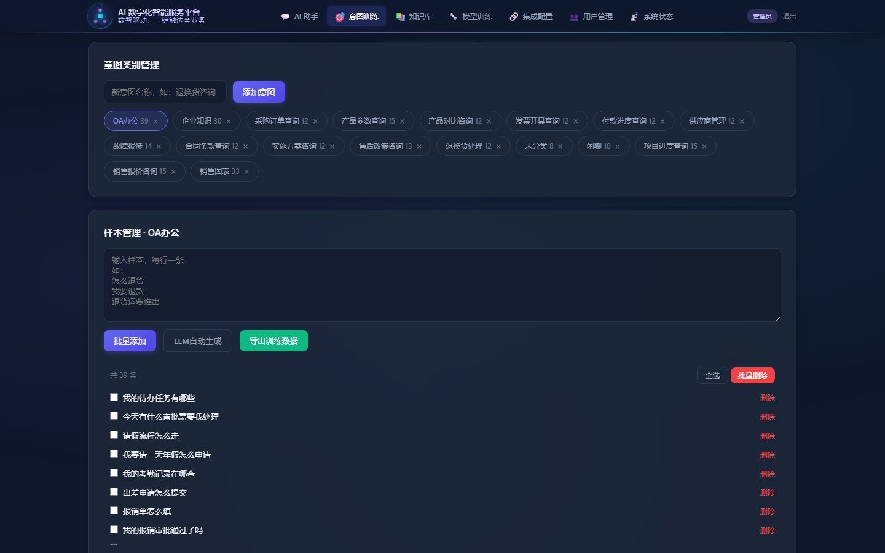
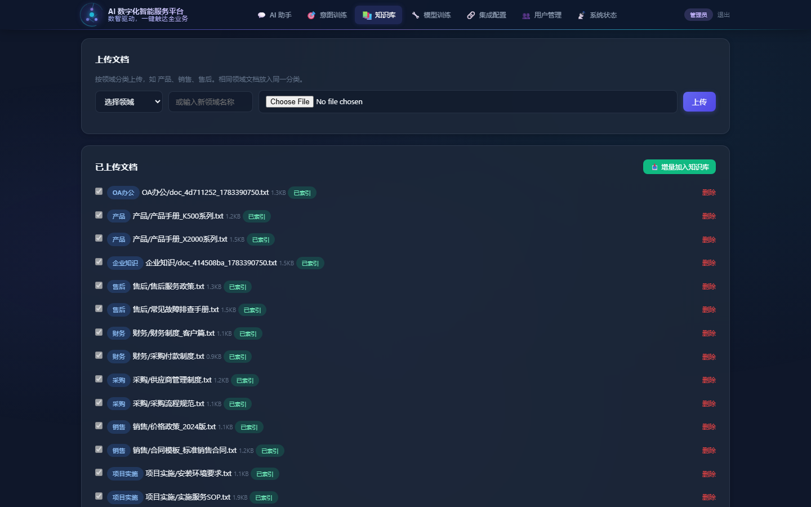
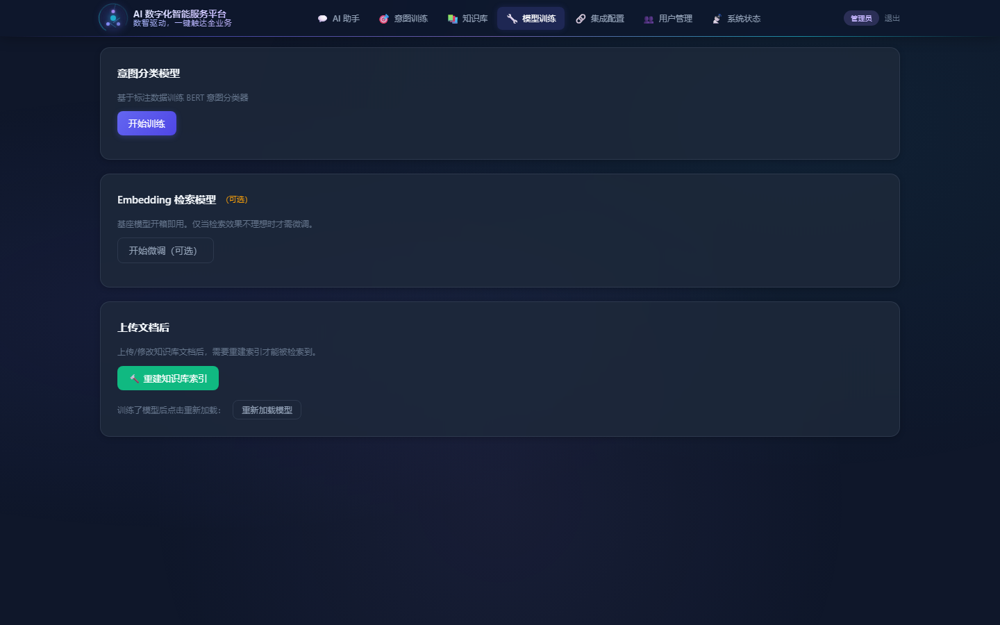
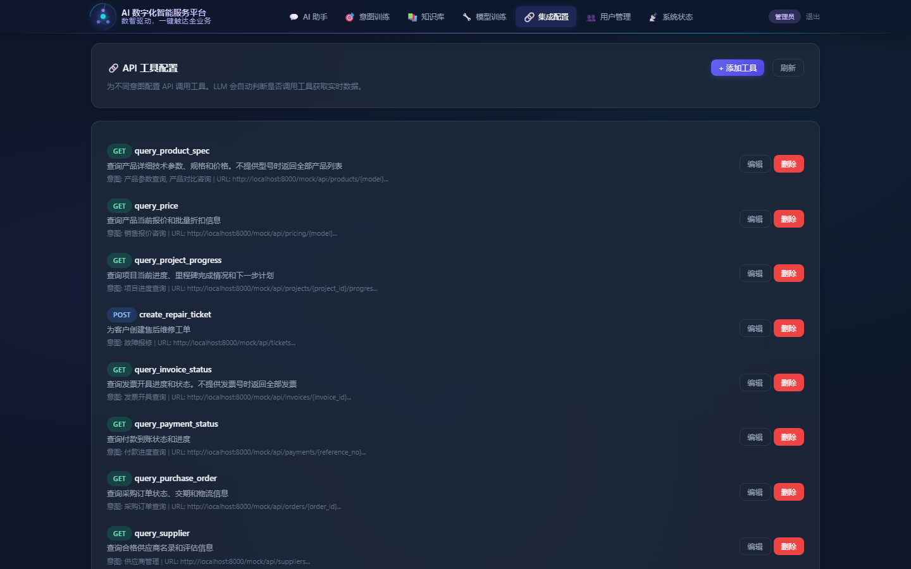
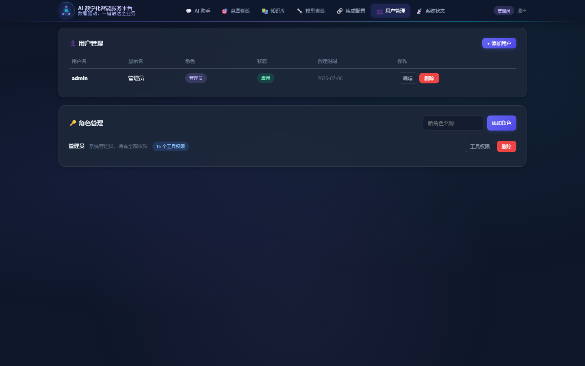
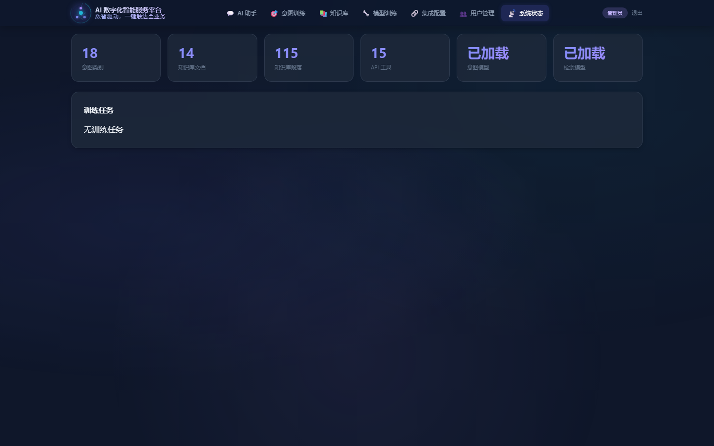

# 🤖 AI 数字化智能服务平台

> **AI 数智驱动，一键触达全业务**

基于深度学习的智能企业助手，集成意图识别、RAG 检索、Reranker 重排序、Function Calling 工具调用和多轮对话能力，覆盖 OA、产品、销售、售后、项目、财务、采购、法务、企业知识九大业务领域。

## 系统架构

```
用户输入 → 意图识别(BERT 18分类) → RAG检索(ChromaDB) → Reranker重排 → Function Calling → LLM(DeepSeek) → 回复
                ↓                        ↓                   ↓               ↓                ↓
           GPU推理<10ms             语义向量检索        CrossEncoder    15个API工具      Markdown渲染
          上下文感知                余弦相似度           精细重排序       实时数据         多轮对话
```

## 技术栈

| 组件 | 技术 |
|------|------|
| 后端框架 | FastAPI v2.0 (Python)，111 个路由，10 个路由模块 |
| 前端界面 | HTMX + Alpine.js 混合架构，玻璃拟态科技感 UI |
| 模板引擎 | Jinja2 服务端渲染 + HTMX 动态片段交换 |
| 意图识别 | BERT (transformers) 微调，18 分类，准确率 97%+ |
| 向量检索 | ChromaDB + SentenceTransformer (bge-small-zh-v1.5) |
| 重排序 | CrossEncoder (bge-reranker-v2-m3) |
| LLM | DeepSeek Chat API（支持 Function Calling） |
| 权限管理 | SQLite RBAC（用户/角色/工具权限） |
| 模型训练 | PyTorch + BERT 在线微调 + Embedding 对比学习 |

## 前端架构

```
HTMX (AJAX 数据加载)  +  Alpine.js (UI 状态管理)
      │                        │
  hx-get/hx-post            x-data / x-show / @click
  服务端返回 HTML 片段        面板切换 / 弹窗 / 双向绑定
```

- **HTMX**：所有 CRUD 操作通过 `hx-*` 属性发请求，服务端返回 HTML 片段直接插入 DOM，无需前端路由
- **Alpine.js**：管理导航面板切换、弹窗状态、表单双向绑定、Token 管理等轻量 UI 状态
- **面板架构**：8 个功能面板（对话/数据/文档/训练/工具/用户/系统/图表），通过 `x-show` 切换

## 目录结构

```
├── system/
│   ├── main.py                  # FastAPI 入口，路由注册，静态文件挂载
│   ├── config.py                # 配置管理（API Key、模型路径）
│   ├── shared.py                # 共享状态（单例、会话、认证辅助）
│   ├── auth_db.py               # SQLite RBAC 用户角色权限
│   ├── data_manager.py          # 意图训练数据管理
│   ├── model_registry.py        # 模型加载与注册（懒加载）
│   ├── knowledge_base.py        # ChromaDB 向量知识库引擎
│   ├── infer.py                 # BERT 意图分类器
│   ├── trainer.py               # 在线训练引擎（意图 + Embedding）
│   ├── tool_manager.py          # Function Calling 工具管理
│   ├── chat_pipeline.py         # 共享聊天管线（JSON API + UI 复用）
│   ├── llm.py                   # DeepSeek LLM 调用封装
│   ├── prompts.py               # System Prompt 配置管理
│   ├── schemas.py               # Pydantic 数据模型
│   ├── mock_data.py             # Mock 数据源（统一）
│   ├── routes/                  # 路由模块（10 个文件，111 路由）
│   │   ├── auth.py              #   登录/登出/token 验证
│   │   ├── chat.py              #   对话 JSON API
│   │   ├── data.py              #   意图训练数据管理
│   │   ├── documents.py         #   知识库文档上传/索引
│   │   ├── mock.py              #   Mock API（17 个 GET + 1 个 POST）
│   │   ├── models.py            #   模型训练/重载/知识库重建
│   │   ├── tools.py             #   API 工具 CRUD
│   │   ├── training.py          #   训练任务管理与进度查询
│   │   ├── ui.py                #   UI HTMX 端点（面板加载、表单提交）
│   │   └── users.py             #   用户/角色管理
│   ├── static/
│   │   ├── ui.html              # 主界面（HTMX + Alpine.js）
│   │   ├── login.html           # 登录页
│   │   ├── css/app.css          # 样式表（科技感设计系统）
│   │   ├── js/app.js            # 前端逻辑（Alpine 状态 + 工具函数）
│   │   └── panels/              # 面板 HTML 片段（HTMX 动态加载）
│   │       ├── chat.html        #   智能对话面板
│   │       ├── data.html        #   意图训练数据面板
│   │       ├── docs.html        #   企业知识库面板
│   │       ├── system.html      #   系统监控面板
│   │       ├── tools.html       #   信息化集成面板
│   │       ├── train.html       #   模型训练面板
│   │       └── users.html       #   用户管理面板
│   └── templates/               # Jinja2 模板（服务端渲染）
│       ├── chat/                #   对话消息模板
│       ├── data/                #   意图/样本模板
│       ├── docs/                #   文档列表模板
│       ├── system/              #   系统状态模板
│       ├── tools/               #   工具表单模板
│       └── users/               #   用户/角色模板
├── data/
│   ├── configs/
│   │   ├── tools.json           # API 工具定义 (15个)
│   │   ├── system_prompts.json  # 意图 System Prompt (18个)
│   │   └── auth.db              # RBAC 数据库
│   ├── training/                # 训练数据（intent_data.json, embedding_triplets.jsonl）
│   └── uploads/                 # 上传文档（按领域分类，14篇）
├── chroma_db/                   # ChromaDB 向量索引文件
├── models/                      # 训练好的模型
│   ├── intent_model/            # BERT 意图分类模型（含历史 checkpoint）
│   └── embedding_model/         # 微调的 Embedding 模型（含历史版本）
├── docs/                        # 文档与媒体
│   ├── system-intro.md          # 系统简介
│   ├── system-intro-mini.md     # 系统简介（精简版）
│   ├── *.png                    # 系统截图（10张）
│   ├── douyin/                  # 抖音宣传视频
│   └── tutorial/                # 教程视频（EP01）
├── scripts/                     # 工具脚本
│   ├── capture_screenshots.py   # 截图+PDF生成
│   ├── init_enterprise_data.py  # 企业数据初始化
│   ├── make_tutorial_ep1.py     # 教程视频生成
│   ├── make_douyin_video.py     # 抖音视频生成
│   └── md2pdf.py                # MD转PDF
├── requirements.txt
└── pyproject.toml
```

## 快速启动

### 环境要求

- Python 3.10+
- CUDA 12.x（可选，用于 GPU 加速）
- 8GB+ RAM

### 安装

```bash
git clone <repo-url> && cd ai-agent
pip install -r requirements.txt

# 配置 DeepSeek API Key
export DEEPSEEK_API_KEY=sk-your-api-key

# 启动服务
python -m system.main
```

访问 http://localhost:8000

### 默认账号

| 用户名 | 密码 | 角色 | 权限 |
|--------|------|------|------|
| admin | 123456 | 管理员 | 全部 15 个工具 |

## 核心功能

### 1. 智能对话

- 18 种意图自动识别（闲聊、OA办公、企业知识、产品对比、销售报价、售后政策、项目进度、发票查询、付款进度、采购订单、供应商管理、销售图表、合同条款、故障报修、退货换货等）
- 上下文感知：自动拼接对话历史辅助意图分类
- RAG 检索 + Reranker 重排序，精准匹配知识库
- Function Calling：自动调用 15 个 API 工具获取实时数据
- Markdown 智能渲染：支持表格、代码块、换行
- 12 个快捷提问按钮，覆盖核心业务场景
- 一键复制 AI 回复，停止生成按钮

### 2. 意图训练数据管理

- 意图 CRUD，样本批量管理
- OA办公、企业知识优先排序
- LLM 自动生成训练样本（种子样本 → 批量变体）
- System Prompt 自定义编辑
- 训练数据导出（训练/验证/测试集自动划分）

### 3. 企业知识库

- 文档按领域分类上传（OA/产品/销售/售后/财务/采购/项目实施/企业知识）
- 自动分段 → Embedding 编码 → ChromaDB 索引
- 增量加入知识库：勾选文档手动添加，无需全量重建
- 已索引文档自动标记，避免重复
- Reranker 重排提升检索精度

### 4. 模型在线训练

- **BERT 意图模型训练**：一键启动，18 分类在线微调
- **Embedding 模型微调**：基于上传文档自动构造三元组（对比学习）
- 训练历史记录，支持切换不同版本模型
- 训练完成一键重载，无需重启服务

### 5. 信息化集成（API 工具管理）

- 工具 CRUD，支持 GET/POST/PUT/DELETE
- JSON Schema 参数定义
- 意图 → 工具关联配置
- URL 模板变量替换 `{param}`

已配置 15 个 API 工具：

| 工具 | 功能 | 关联意图 |
|------|------|----------|
| query_product_spec | 产品规格查询（可列全部） | 产品参数查询, 产品对比咨询 |
| query_price | 报价与折扣计算 | 销售报价咨询 |
| query_project_progress | 项目进度（可列全部） | 项目进度查询 |
| query_invoice_status | 发票状态（可列全部） | 发票开具查询 |
| query_payment_status | 付款状态 | 付款进度查询 |
| query_purchase_order | 采购订单 | 采购订单查询 |
| query_supplier | 供应商查询 | 供应商管理 |
| query_sales_data | 销售月度数据 | 销售图表 |
| query_sales_breakdown | 销售区域/产品分布 | 销售图表 |
| query_contract | 合同查询（可列全部） | 合同条款查询 |
| create_repair_ticket | 创建维修工单 | 故障报修 |
| query_oa_tasks | OA待办任务查询 | OA办公 |
| query_leave_balance | 假期余额查询 | OA办公 |
| query_org_structure | 组织架构查询 | 企业知识 |
| query_company_policy | 企业制度查询 | 企业知识 |

### 6. 用户管理（RBAC）

- SQLite 持久化用户/角色/权限
- 角色 → 工具权限绑定，UI 可视化配置（勾选式权限面板）
- `/chat` 自动按角色过滤工具（未授权工具不传入 LLM Function Calling）
- SHA256 密码哈希，支持在线修改密码

## 企业解决方案

### 解决的核心痛点

| 痛点 | AI 解决方案 |
|------|------------|
| 信息孤岛 | 统一对话入口，15个API工具集成各系统 |
| 响应缓慢 | 意图自动识别+工具调用，端到端<2秒 |
| 知识流失 | 知识库+语义检索，7x24 AI问答 |
| 权限混乱 | RBAC三级管控，源头拦截未授权工具 |
| 数据沉睡 | AI自动分析，一句话生成趋势洞察 |

### 项目实施流程

```
商务对接 → 系统演示 → 咨询调研 → 项目合同 → 现状调研 → AI业务设计
→ 数据加工 → 模型训练 → API集成 → 测试优化 → 交付 → 验收付款
```

详见 [系统简介](docs/system-intro.md)

## API 文档

启动后访问 http://localhost:8000/docs 查看 Swagger UI。

### API 路由一览

| 模块 | 路由前缀 | 说明 |
|------|---------|------|
| Auth | `/login`, `/logout`, `/user/info` | 登录认证 |
| Chat | `/chat` | 对话 JSON API（SSE 流式） |
| Data | `/data/*` | 意图训练数据管理 |
| Documents | `/documents/*` | 知识库文档 CRUD |
| Training | `/train/*` | 模型训练任务 |
| Models | `/models/*` | 模型重载、知识库重建 |
| Tools | `/tools` | API 工具定义管理 |
| Users | `/users`, `/roles` | 用户角色权限管理 |
| Mock | `/mock/api/*` | Mock 数据接口（18个） |
| **UI** | `/ui/*` | **HTMX 面板端点**（38个，返回 HTML 片段） |

## 系统截图

| 智能对话 | 训练数据 | 知识库 |
|----------|---------|--------|
|  |  |  |

| 模型训练 | 工具管理 | 用户管理 |
|----------|---------|--------|
|  |  |  |

| 系统监控 | OA办公演示 | 企业知识演示 |
|----------|-----------|------------|
|  |  |  |

## 配置

| 变量 | 说明 | 默认值 |
|------|------|--------|
| DEEPSEEK_API_KEY | DeepSeek API 密钥 | 必填 |
| DEEPSEEK_API_URL | DeepSeek API 地址 | https://api.deepseek.com/v1/chat/completions |

## 模型

| 模型 | 路径 | 参数 | 说明 |
|------|------|------|------|
| 意图分类 BERT | models/intent_model | 102M, 18分类 | 在线微调，多版本可切换 |
| Embedding 检索 | models/embedding_model | 24M, dim=512 | bge-small-zh-v1.5 基座 |
| Reranker | BAAI/bge-reranker-v2-m3 | HF Hub 自动下载 | CrossEncoder 精排 |

---

**Powered by** FastAPI · HTMX · Alpine.js · BERT · SentenceTransformers · ChromaDB · DeepSeek · Jinja2
